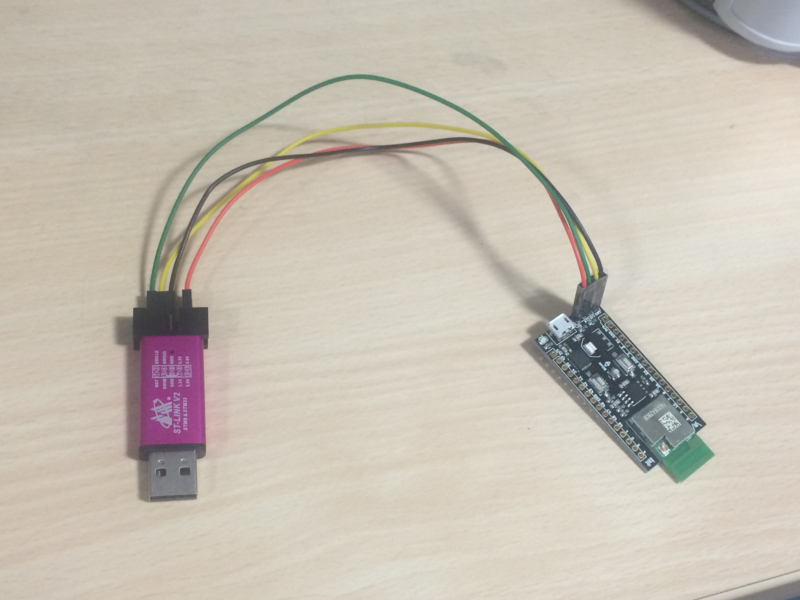

# Makerville Knit

<a href="https://makerville.io/knit/" target="_blank" class="button">Buy Now</a>

* 32-bit Cortex M4F at 200Mhz
* 512KB SRAM
* 4MB flash with XIP support
* 802.11 b/g/n with FCC, IC, CE certification
* 1 user LED & 1 user button

The multiplexed peripherals include -

|#|Protocol|
|:-:|:-:|
| 2| UARTs|
| 2| I2C channels|
| 7| PWM/GPT|
| 2| SSPs|
| 6| ADCs - 16 bit|
| 2| Wake up|
| 1| DAC - 10 bit|
| 25| GPIOs|


## Using ST Link for debugging

Makerville Knit doesn't provide an onboard JTAG debugger to keep the dev board low cost. It comes with a USB to serial converter IC (CP210X), which can be used to get console access using a tool like [PuTTY](http://www.putty.org/), [`minicom`](http://linux.die.net/man/1/minicom) or similar.

To make the Knit board work with Eclipse IDE using OpenOCD, and get complete hardware debugging, it is necessary to use an external debugger. The STLink V2 is the ideal choice because of it's low cost. It is available on [Adafruit](https://www.adafruit.com/products/2548?gclid=COzF3_6Rm8wCFdBZhgodadEIxQ) as well as [Amazon.com](https://www.amazon.com/s/?url=search-alias%3Daps&field-keywords=st+link+). You can find it on Aliexpress and others too.

The Knit board has a 4 pin header, next to the USB port, for directly connecting the ST Link debugger to the board. Make sure that you have still connected your USB micro cable so that you continue to get complete console access to the controller using `minicom` or similar.

Jumper connections -

|ST Link|Knit 4-pin header|
|::|::|
|5.0V|5V|
|SWCLK|CLK|
|SWDIO|DIO|
|GND|GND|

</img>

## Board File, Binaries and Flashing

The board file associated with the Knit board in the EZ Connect Lite SDK is `knit-v1.c`.

Here's how to compile a simple `hello_world` for Knit -
```
make APP=sample_apps/hello_world BOARD_FILE=sdk/src/boards/knit-v1.c
```

The generated binaries can be found in the `bin/knit-v1`


When flashing the Knit board using the ST Link as a debugger, make sure that you set it as an interface in the parameters of `flashprog.py` and `ramload.py`.

```
python sdk/tools/OpenOCD/flashprog.py -i stlink --mcufw <path to your bin>
```

or

```
python sdk/tools/OpenOCD/ramload.py -i stlink <path to your axf>
```

If you are using Eclipse, use the `Select Debug interface` launcher to set the default value to `stlink`


## Pin Map

- Knit has 2 16 pin headers, which are breadboard friendly.It also has a 4 pin header for easy SWD programming.
- The header file where all the pin functions are defined is [mw300_pinmux.h](https://github.com/marvell-iot/aws_starter_sdk/blob/master/sdk/src/incl/sdk/drivers/mw300/mw300_pinmux.h)

### Header 1

|No|     Fn 0|         Fn 1      | Fn 2|        Fn 3|       Fn 4|       Fn 5|
|:-:|:-:|:-:|:-:|:-:|:-:|:-:|
|6	|  TDO	    |  GPIO6    |  I2C1_SDA	|DIG_POR|    RC32M      |AUPLL_DIGTP0|
|9 |  TDI	      |GPIO9	  |UART2_TXD   |SSP2_TXD   |I2C1_SDA   |AUPLL_DIGTP3|
|10 |	TRST_N       |GPIO10|	 UART2_RXD   |SSP2_RXD  | I2C1_SCL|   PHY_MON0|
|7	|  TCK         | GPIO7|	  UART2_CTSn | SSP2_CLK|   I2C0_SDA   |AUPLL_DIGTP1|
|8	|  TMS	      |GPIO8	 | UART2_RTSn  |SSP2_FRM  | I2C0_SCL|   AUPLL_DIGTP2|
|25 |    XTAL32K_IN  | GPIO25|     I2C1_SDA	|		-|-|-|
|26  |   XTAL32K_OUT|  GPIO26 |    I2C1_SCL|-|-|-|			
|23  |  WAKE_UP1|	 GPIO23     |UART0_CTSn|  -|SFLL_200N|  COMP_IN_P|
|22  |  WAKE_UP0|	 GPIO22		|-|-|-|		-|
|GND|GND|GND|GND|GND|GND|GND|					
|3	 | GPIO3|        GPT0_CH3 |  UART0_RXD   |SSP0_RXD|-|-|		
|2	|  GPIO2 |       GPT0_CH2|   UART0_TXD  | SSP0_TXD|-|-|		
|5V|5V|5V|5V|5V|5V|5V|					
|GND|GND|GND|GND|GND|GND|GND|						
|3V3|3V3|3V3|3V3|3V3|3V3|3V3|		
|3V3|3V3|3V3|3V3|3V3|3V3|3V3|			

### Header 2

|No|     Fn 0|         Fn 1      | Fn 2|        Fn 3|       Fn 4|       Fn 5|
|:-:|:-:|:-:|:-:|:-:|:-:|:-:|
|4|     GPIO4	|GPT0_CH4|      I2C0_SDA|           AUDIO_CLK|	-|-|
|5|     GPIO5	|GPT0_CH5 |     I2C0_SCL	|		-|-|-|
|0   |  GPIO0|	GPT0_CH0|      UART0_CTSn  |       SSP0_CLK		|-|-|
|1  |   GPIO1	|GPT0_CH1|      UART0_RTSn |        SSP0_FRM	|-|-|
|49	|GPIO49  | ADC0_IN7<br/>ACOMP_IN7  |    UART2_RXD |         SSP2_RXD  |          -|PHY_MON15|
|48	|GPIO48   |ADC0_IN <br/>ACOMP_IN6|      UART2_TXD|          SSP2_TXD|            -|PHY_MON14|               
|47	|GPIO47|   ADC0_IN5<br/>ACOMP_IN5|      UART2_RTSn|         SSP2_FRM|            -|PHY_MON13|
|46	|GPIO46|   ADC0_IN4<br/>ACOMP_IN4|      UART2_CTSn|         SSP2_CLK|            -|PHY_MON12|
|GND|GND|GND|GND|GND|GND|GND|												
|43	|GPIO43 |  ADC0_IN1<br/>ACOMP_IN1|      UART1_RTSn|         SSP1_FRM|            TRACE_DATA1|        PHY_MON9|
|42	|GPIO42|   ADC0_IN0 <br/>ACOMP_IN0|     UART1_CTSn|         SSP1_CLK|            TRACE_DATA0|        PHY_MON8|
|41	|GPIO41|   GAU_TRIGGER1  |ACOMP0_EDGE_PULSE|  ACOMP1_EDGE_PULSE|   -|TRACE_CLKOUT|
|24	|OSC32K|   GPIO24        |UART0_RXD|          GPT1_CH5|            -|COMP_IN_N|
|39	|GPIO39 |  GPT3_CLKIN   | UART1_RXD|          SSP1_RXD|            -|RC32M_CLKINb|
|40	|GPIO40  | GAU_TRIGGER0|  ACOMP0_GPIO_OUT|    ACOMP1_GPIO_OUT|		-|-|
|3V3|3V3|3V3|3V3|3V3|3V3|3V3|			

- Color coded pinmaps <br/>[Header 1 >](./support/header1.png) [Header 2 >](./support/header2.png)

</img>
